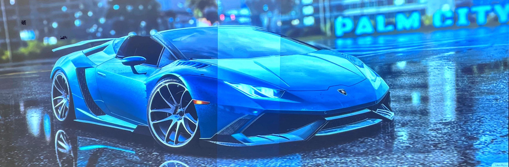
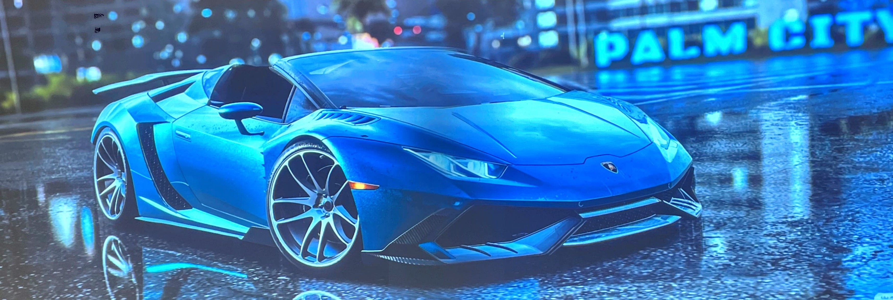

<h1 align="center"> University Project Archive 📚</h1>

    
  

> An image edge-blending python script.  
> Perform image processing to eliminate color distortion and optical crack in the joint area. Doxygen-styled.

### Example

- Before image edge-blending

- After image edge-blending

## Author

👤 Xu Minghao [@xu-minghao317](https://github.com/xu-minghao317)

## Show your support

Give a ⭐️ if this project helped you!

## 📝 License

This project is MIT License licensed.
